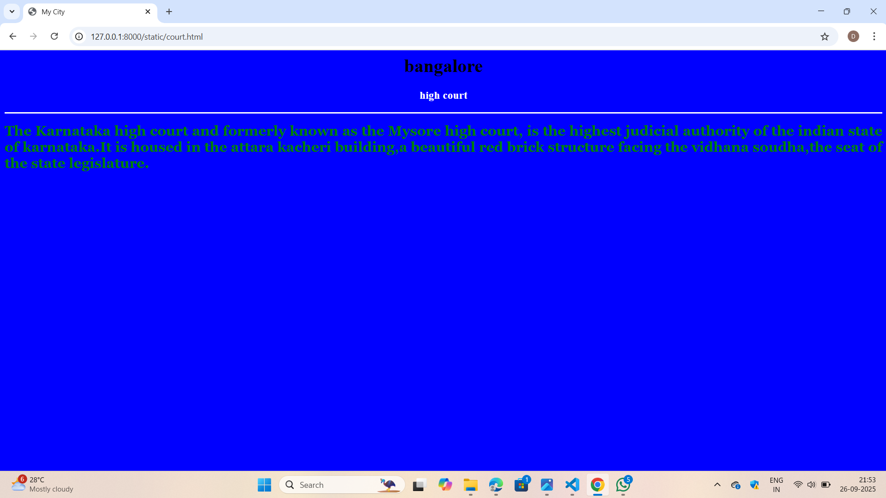
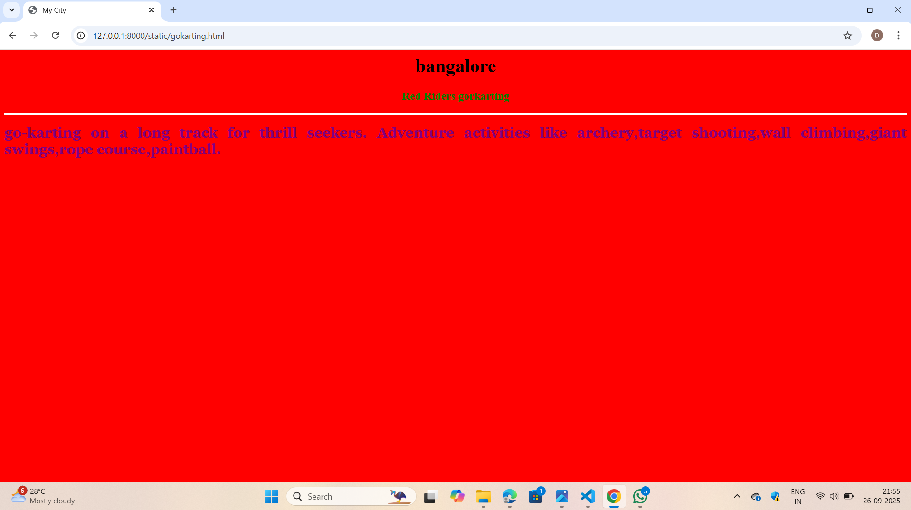
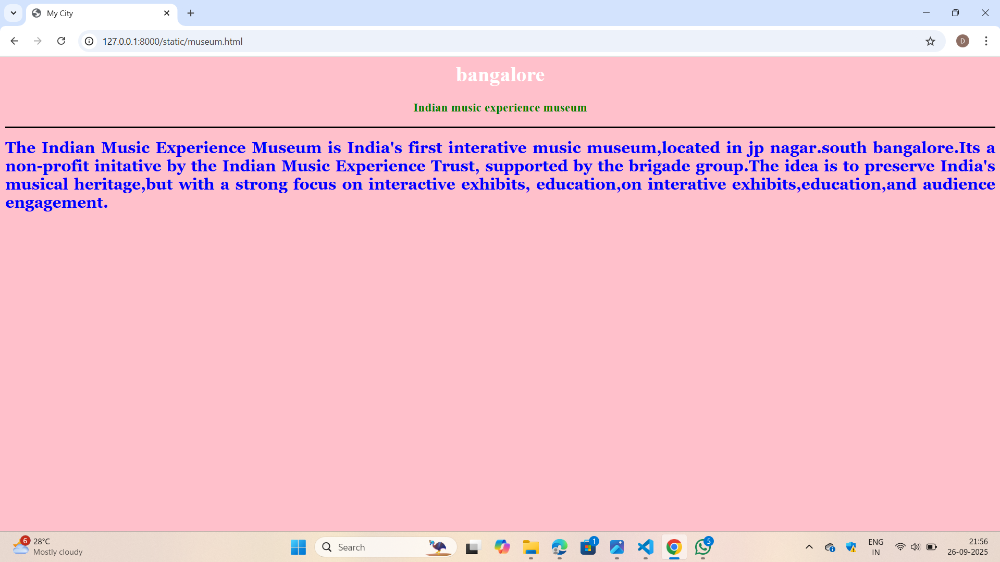
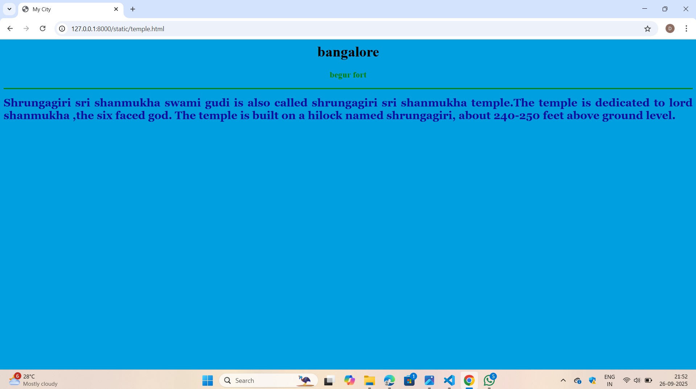
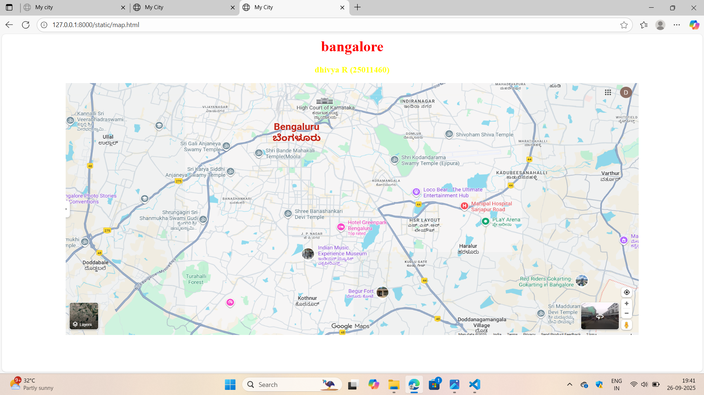

# Ex04 Places Around Me
## Date: 26.09.2025

## AIM
To develop a website to display details about the places around my house.

## DESIGN STEPS

### STEP 1
Create a Django admin interface.

### STEP 2
Download your city map from Google.

### STEP 3
Using ```<map>``` tag name the map.

### STEP 4
Create clickable regions in the image using ```<area>``` tag.

### STEP 5
Write HTML programs for all the regions identified.

### STEP 6
Execute the programs and publish them.

## CODE
```
map.html
<html>
    <head>
        <title>My City</title>
    </head>
    <body>
        <h1 align="center">
            <font color="red"><b>bangalore</b></font>

        </h1>
        <h3 align="center">
            <font color="yellow"><b>dhivya R (25011460)</b></font>
        </h3>
        <center>
        
        

         <map name="image-map">
             <area target="" alt="Begur Fort" title="Begur Fort" href="Begur fort.html" coords="919,703,1077,780" shape="rect">
             <area target="" alt="Red riders Gokarting-Gokarting in Bangalore" title="Red riders Gokarting-Gokarting in Bangalore" href="gokarting.html" coords="1627,701,128" shape="circle">
             <area target="" alt="Indian Music Experience Museum" title="Indian Music Experience Museum" href="museum.html" coords="816,558,999,649" shape="rect">
             <area target="" alt="Shrungagiri sri shanmukha swami gudi" title="Shrungagiri sri shanmukha swami gudi" href="Temple.html" coords="357,483,117" shape="circle">
             <area target="" alt="high court of karnataka" title="high court of karnataka" href="court.html" coords="748,45,930,36,985,80,930,127,755,127" shape="poly">
        </map>
        </center>

    </body>
</html>
begur fort.html

<html>
    <head>
        <title>My City</title>
    </head>
    <body bgcolor="green">
    <h1 align="center">
    <font color="pink"><b>bangalore</b></font>
    </h1>
    <h3 align="center">
    <font color="brown"><b>begur fort</font>
    </h3>
    <hr size="3" color="brown">
    <p align="justify">
    <font face="georgia" size="5" color="cyan">
       The Begur Fort is the oldest fort in bangalore and is believed to have come up in the 8th or 9th centuries by the cholas or during the ganga dynasty.It was originally a circular Fort built with mud walls.
    </font>
    </p>
    </body>
    </body>
</html>

court.html
<html>
    <head>
        <title>My City</title>
    </head>
    <body bgcolor="blue">
    <h1 align="center">
    <font color="black"><b>bangalore</b></font>
    </h1>
    <h3 align="center">
    <font color="white"><b>high court</font>
    </h3>
    <hr size="3" color="white">
    <p align="justify">
    <font face="georgia" size="5" color="green">
        The Karnataka high court and formerly known as the Mysore high court, is the highest judicial authority of the indian state of karnataka.It is housed in the attara kacheri building,a beautiful red brick structure facing the vidhana soudha,the seat of the state legislature.
       
    </font>
    </p>
    </body>
    </body>
</html>

gokarting.html
<html>
    <head>
        <title>My City</title>
    </head>
    <body bgcolor="red">
    <h1 align="center">
    <font color="black"><b>bangalore</b></font>
    </h1>
    <h3 align="center">
    <font color="green"><b>Red Riders gorkarting</font>
    </h3>
    <hr size="3" color="white">
    <p align="justify">
    <font face="georgia" size="5" color="purple">
       go-karting on a long track for thrill seekers. Adventure activities like archery,target shooting,wall climbing,giant swings,rope course,paintball.
    </font>
    </p>
    </body>
    </body>
</html>

museum.html
<html>
    <head>
        <title>My City</title>
    </head>
    <body bgcolor="pink">
    <h1 align="center">
    <font color="white"><b>bangalore</b></font>
    </h1>
    <h3 align="center">
    <font color="green"><b>Indian music experience museum</font>
    </h3>
    <hr size="3" color="black">
    <p align="justify">
    <font face="georgia" size="5" color="blue">
       The Indian Music Experience Museum is India's first interative music museum,located in jp nagar.south bangalore.Its a non-profit initative by the Indian Music Experience Trust, supported by the brigade group.The idea is to preserve India's musical heritage,but with a strong focus on interactive exhibits, education,on interative exhibits,education,and audience engagement.
    </font>
    </p>
    </body>
    </body>
</html>

temple.html
<html>
    <head>
        <title>My City</title>
    </head>
    <body bgcolor="organge">
    <h1 align="center">
    <font color="black"><b>bangalore</b></font>
    </h1>
    <h3 align="center">
    <font color="green"><b>begur fort</font>
    </h3>
    <hr size="3" color="green">
    <p align="justify">
    <font face="georgia" size="5" color="sandal">
       Shrungagiri sri shanmukha swami gudi is also called shrungagiri sri shanmukha temple.The temple is dedicated to lord shanmukha ,the six faced god. The temple is built on a hilock named shrungagiri, about 240-250 feet above ground level.
    </font>
    </p>
    </body>
    </body>
</html>


 ```
 ## OUTPUT












## RESULT
The program for implementing image maps using HTML is executed successfully.
